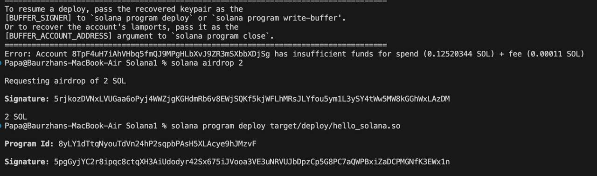

## Rust Smart Contract

This is a basic Solana smart contract written in Rust that prints a message to the program logs.  
A great starting point for learning how to build on the Solana blockchain using Rust

---

## 📦 Prerequisites

Before you begin, ensure you have the following installed:

- [Solana CLI](https://docs.solana.com/cli/install-solana-cli-tools)
- [Rust + Cargo](https://www.rust-lang.org/tools/install)
- Node.js and Yarn (optional, if integrating with frontend)

## 📦 Usage

```bash
cargo build-sbf
solana airdrop 2
solana program deploy target/deploy/hello_solana.so
cargo build-sbf -- -Znext-lockfile-bump
```



